# Apex MMA
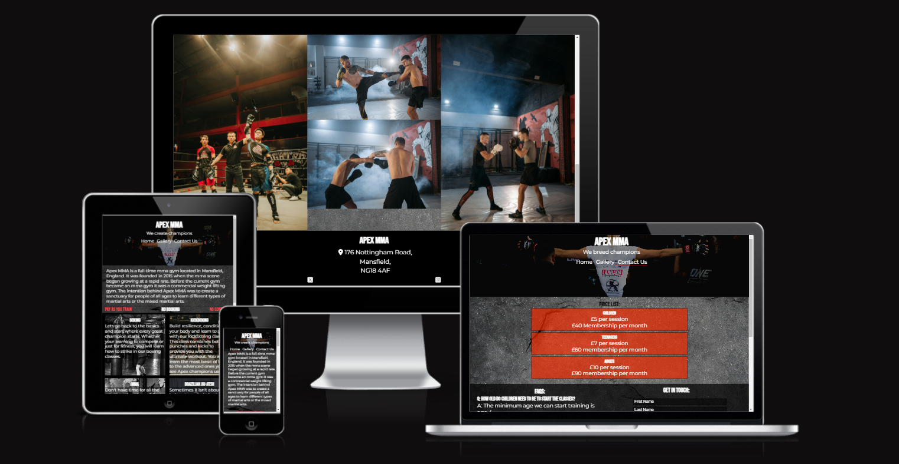
Apex MMA is a website created for a local gym that teaches mixed martial arts. The target audience for the website is not limited to age however the primary target is people who are interested in MMA, as well as looking for ways to remain fit or are looking for a way to increase their fitness.

Apex MMA contains three pages which are; home, gallery and contact us. The homepage has a small about us section, a what we teach section and a time table of when these sessions occur. The gallery page contains ten images of people participating at the club. The contact us page is devided into three sections which are; prices, FAQs and a sign up form.

## Features
### Existing features
#### The Header
* The header of Apex MMA shows the name of the club and contains navigation with the option to select between home, gallery and contact us.
* The header has a background image to enagage users as it is one of the first things they will see.

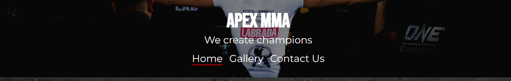

#### Navigation
* The navigation bar is apart of the header and features on all three pages of the website and it contains the sections home, gallery and contact us.
* This section allows the user to navigate throughout the website without having to use the browsers 'foward' and 'back' buttons.

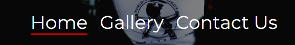

#### About us
* The about us section is located at the top of the home page and it contains a brief description of how and why the club was created.

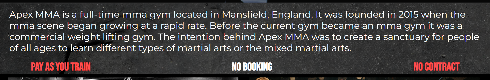

#### What we teach
* The what we teach section is also located on the homepage and it gives the user the options of what the club teaches.
* This is located on the homepage as it would be one of the first things the user sees so it gives insight into what the club offers.

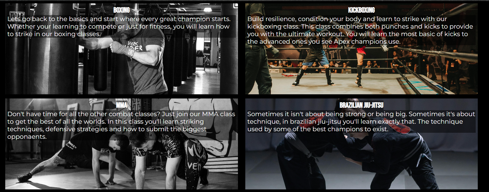

#### Session time table
* The session time table informs the user on what lessons will be taught on which days and the times the sessions occur.
* If any other lessons are implemented or any other session types are added the session time table will be updated to include these changes.

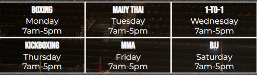

#### Gallery
* The gallery is the second page of Apex MMA and it provides supporting images to the website.
* The gallery also informs the user of the types of activities they could participate in.

#### Price list
* The price list is the first section at the top of the contact us page and it informs the user of the prices for each age range.

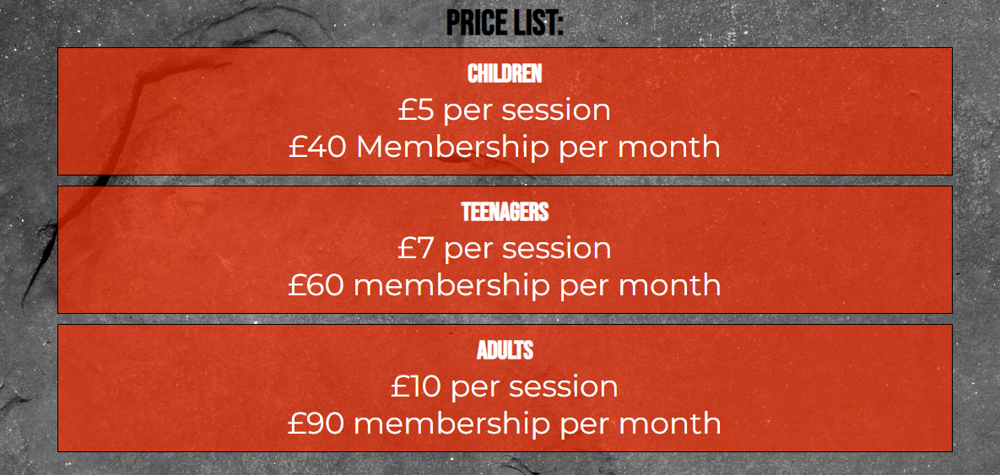

#### FAQs
* FAQs is a small section containing frequently asked questions by users and people considering joining the club.
* As more questions are asked regarding the club they will be added to the FAQs section so the website can provide as much information as possible.

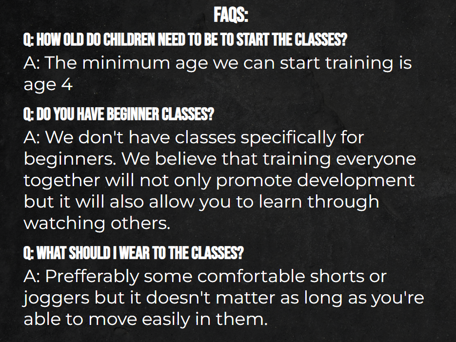

#### Enquiry
* The enquiry section is a form that allows users to ask any questions they have about the club. It's also an opportunity for the club to keep in touch with potential clients/members.

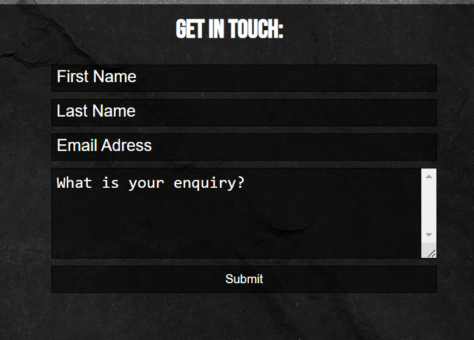

#### Footer
* The footer is the section below the main content of the page, which is also on all pages of the website.
* The footer contains an adress and four social media links to the main social media platforms.

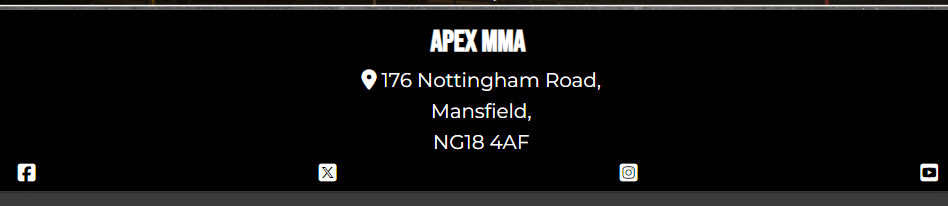

### Future features

## Technologies used 
* [HTML5](https://html.spec.whatwg.org/) - provides initial content and structure for the website
* [CSS](https://www.w3.org/Style/CSS/Overview.en.html) - provides styling for the website
* [GitHub](https://github.com/) - used to deploy the website
* [GitPod](https://www.gitpod.io/) - used to create and edit the website

## Testing
#### Validator testing
* No errors were found on W3C CSS validator - [Apex MMA CSS validator](https://jigsaw.w3.org/css-validator/validator?uri=https%3A%2F%2Fregan-boreland.github.io%2FApexMMA%2F&profile=css3svg&usermedium=all&warning=1&vextwarning=&lang=en)
* No errors were found on W3C HTML valitdator - [Apex MMA HTML validator](https://regan-boreland.github.io/ApexMMA/)
* I confimred the contrasting colours is easy to read and the accesability throughout the website is good. I did this by running the website through lighthouse.

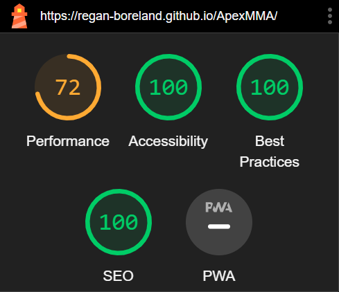

#### Fixed bugs
| Bug | Solution |
| ---| ---|
| favicon not loading | this was resolved by reviewing the favicon link and replacing the 'a' in assets from capital to lowercase |
| horizontal scroll on mobile phones and tablets | used a declaration to hide the overflow on the x-axis |
| header covering text main content on high resolution devices | used google chrome dev tools to adjust the resolution so i could view the change then adjusted the margin top to match the header size |
| form can be submitted without a first and last name | added an asset to the form declaration to make those fields required |

#### Unfixed bugs 
* When rotating a mobile phone horizontal the navigation doesn't fit into the header and navigation covers the text.

## Credits
#### Media
* Gallery images were taken from [pexels](https://www.pexels.com/).
* Header background image was taken from [unsplash](https://unsplash.com/photos/woman-wearing-white-shirt-and-black-grappling-gloves-7RJTPLgwMsc).
* Timetable background image was taken from [unsplash](https://unsplash.com/photos/a-wrestling-ring-in-an-empty-arena-with-a-man-standing-on-it-pSWfkJgAKGg).
#### Content
* Icons in the footer were taken from [font awesome](https://fontawesome.com/).
* Favicon was taken from [icons8](https://icons8.com/icons/set/predator).
* Information on [removing horizontal scroll](https://stackoverflow.com/questions/17756649/disable-the-horizontal-scroll).
#### Acknowledgment
* Mentor: Jubril Akolade (assisting in making the form inputs required)

## Deployment
### The site was deployed to github pages. The setps to do this are:
* In the github repository go into the settings tab and select pages under the subsection code and automation.
* Under the build and deployment section ensure the main branch is selected and the folder selected is /(root).
* Save these settings and return to the code tab of the repository.
* Under the deployment section select the deployments link.
* View your live link.
#### Live link to the website can be found here - [Apex MMA](https://github.com/Regan-Boreland/ApexMMA/deployments)

