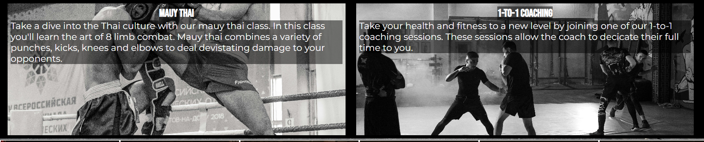

# Apex MMA

Apex MMA is a website created for a local gym that teaches mixed martial arts. The target audience for the website is not limited to age however the primary target is people who are interested in MMA, as well as looking for ways to remain fit or are looking for a way to increase their fitness.

#### Live link to the website can be found here - [Apex MMA](https://github.com/Regan-Boreland/ApexMMA/deployments)

## User experience (UX)
#### Wireframes
In the wireframe stage, I used a [wireframe.cc](https://wireframe.cc/) to design the initial structure of the home page. Once I had created the baseline, I decided to add content and images when it improved the visual quality and the user experience of the website.

#### Site structure
Apex MMA contains three pages which are; home, gallery and contact us. The homepage has a small about us section, a what we teach section and a timetable of when these sessions occur. The gallery page contains ten images of people participating at the club. The contact us page is divided into three sections which are; prices, FAQs and a sign-up form.
### User stories
##### First time visitors
* I want to get information on a mixed martial arts club in my local area.
* I want the site to be responsive to my device and maintain good accessibility.
* I want a website that has easy to use navigation but also informs me what page I am looking at.
* I want to be able to contact the club if I would like any information that isn't on the website.
##### Returning visitors 
* I want to be able to maintain contact with the club and remain informed about any changes to the club.
### Design choices
#### Colour scheme
I have selected three colours for the colour scheme which are white, red and black. I have selected these colours to ensure the contrast between the text, and background colours and backgrounds images makes the text readable for all users.
#### Typography
I have chosen two different fonts to use on the website which are 'montserrat' and 'bebas neue'. These fonts fit the theme of the website because they are large fonts and make the content easily readable. 
## Features
### Existing features
#### The Header
* The header of Apex MMA shows the name of the club and contains navigation with the option to select between home, gallery and contact us.
* The header has a background image to engage users as it is one of the first things they will see.

#### Navigation
* The navigation bar is a part of the header and features on all three pages of the website.
* The navigation bar contains the pages home, gallery and contact us.
* This section allows the user to navigate throughout the website without having to use the browsers 'forward' and 'back' buttons.

#### About us
* The about us section is located at the top of the home page, and it contains a brief description of how and why the club was created.

#### What we teach
* What we teach is a section located on the homepage and it provides the user information on what the club teahces.
* This is located on the homepage as it would be one of the first things the user sees so it gives insight into what the club offers.

#### Session timetable
* The session timetable informs the user on what lessons will be taught on which days and the times the sessions occur.
* If any other lessons are implemented or any other session types are added the session timetable will be updated to include these changes.

#### Gallery
* The gallery is the second page of Apex MMA, and it provides supporting images to the website.
* The gallery also informs the user of the types of activities they could participate in.

#### Price list
* The price list is the first section at the top of the contact us page and it informs the user of the prices for each age range.

#### FAQs
* FAQs is a small section containing frequently asked questions by users and people considering joining the club.
* As more questions are asked regarding the club they will be added to the FAQs section so the website can provide as much information as possible.

#### Enquiry
* The enquiry section is a form that allows users to ask any questions they have about the club. It's also an opportunity for the club to keep in touch with potential clients/members.

#### Footer
* The footer is the section below the main content of the page, which is also on all pages of the website.
* The footer contains an address and four social media links to the main social media platforms.

### Future features
* Upload videos to the gallery rather than just images so users can see examples of what they will be learning.
* Add a booking system so users can book private sessions.
* Add information about coaches and private trainers.
## Accessibility
During the creation of the website I have kept the accessibility as friendly as possible, I have done this by:
* Using semantic HTML.
* Ensuring the colours have sufficent contrast.
* Using alt attributes on all images and links so screen readers understand their use.
* Used a clear font that is easy to read. 
## Testing
Content regarding testing is on [testing file](TESTING.md)
## Technologies used 
* [HTML5](https://html.spec.whatwg.org/) - provides initial content and structure for the website
* [CSS](https://www.w3.org/Style/CSS/Overview.en.html) - provides styling for the website
* [GitHub](https://github.com/) - used to deploy the website
* [GitPod](https://www.gitpod.io/) - used to create and edit the website

## 
## Credits
#### Media
* Gallery images were taken from [pexels](https://www.pexels.com/).
* Header background image was taken from [unsplash](https://unsplash.com/photos/woman-wearing-white-shirt-and-black-grappling-gloves-7RJTPLgwMsc).
* Timetable background image was taken from [unsplash](https://unsplash.com/photos/a-wrestling-ring-in-an-empty-arena-with-a-man-standing-on-it-pSWfkJgAKGg).
#### Content
* Icons in the footer were taken from [font awesome](https://fontawesome.com/).
* Favicon was taken from [icons8](https://icons8.com/icons/set/predator).
* Information on [removing horizontal scroll](https://stackoverflow.com/questions/17756649/disable-the-horizontal-scroll).
#### Acknowledgment
* Mentor: Jubril Akolade

### Deployment & Local Deployment
#### Deployment
###### The site was deployed to GitHub pages. The steps to do this are:
* In the GitHub repository go into the settings tab and select pages under the subsection code and automation.
* Under the build and deployment section ensure the main branch is selected and the folder selected is /(root).
* Save these settings and return to the code tab of the repository.
* Under the deployment section select the deployments link.
* View your live link.

#### Local Deployment
##### Fork
###### The steps to fork are:
* Log in to Github 
* Go to the repository for Apex MMA, [Regan Boreland/ApexMMA](https://github.com/Regan-Boreland/ApexMMA)
* Click fork on the right hand side of the screen (located between notifications and star/saved)

##### Clone
* Log in to Github 
* Go to the repository for Apex MMA, [Regan Boreland/ApexMMA](https://github.com/Regan-Boreland/ApexMMA)
* Click on the code option and select what you would like to clone with, either: HTTPS, SSH or GitHub CLI. 
* Open the terminal in your selected code editor and change the current working directory to the location of where you want the cloned directory.
* Type "Git clone" into the terminal and press enter on your keyboard. 

